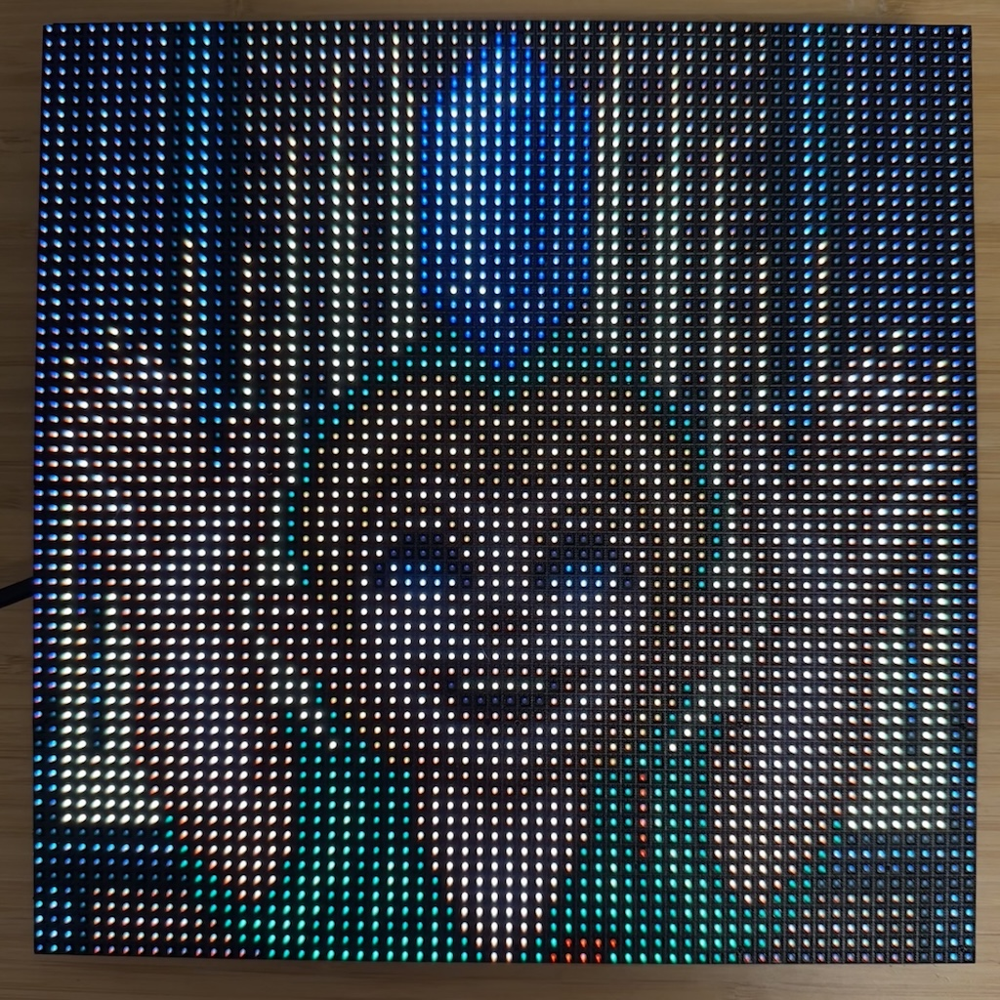

# HD-WFx LED Matrix custom firmware



This project provides custom firmware for the **Huidu HD-WF1** and **HD-WF2** boards running ESP32 to control HUB75 LED matrix panels via the ESP32-HUB75-MatrixPanel-DMA library. The ESP32 acts as a basic GPU, listening for drawing commands over Serial and rendering graphics accordingly.

## Features

- **Drawing Commands**: Pixels, lines, rectangles, text
- **Sprite System**: Store and manipulate up to 16 sprites in memory
- **Image Support**: Display bitmaps and images
- **Serial Protocol**: Simple command-based communication
- **Python CLI**: Full-featured command-line interface
- **Real-time Graphics**: Low-latency drawing operations

## Hardware Support

This firmware is specifically designed for:
- **Huidu HD-WF1** (ESP32-S2 based)
- **Huidu HD-WF2** (ESP32-S3 based)

Both boards feature HUB75 LED matrix panel support with DMA capabilities for smooth graphics rendering.

## Installation & Flashing

### Prerequisites

1. Install [PlatformIO](https://platformio.org/) or Arduino IDE
2. Short the `GPIO0` pins exposed on the board (puts it in flashing mode)
3. Connect your board via USB A to USB A cable

### Flashing Using PlatformIO

```bash
# Clone the repository
git clone https://github.com/yourusername/wfx-led-panel.git
cd wfx-led-panel

# Flash for HD-WF1
pio run -e huidu_hd_wf1 -t upload

# Flash for HD-WF2
pio run -e huidu_hd_wf2 -t upload

# Monitor serial output
pio device monitor
```

## Usage

### Python CLI

The project includes a comprehensive Python CLI for easy interaction with the LED matrix. See the [CLI Documentation](cli/README.md) for detailed usage instructions.

```bash
# Install the CLI
cd cli
poetry install

# Basic usage examples
poetry run matrix-cli ports
poetry run matrix-cli brightness --port /dev/ttyUSB0 128
poetry run matrix-cli print --port /dev/ttyUSB0 "Hello World"
poetry run matrix-cli clear --port /dev/ttyUSB0
```

### Sprite System

The firmware includes a powerful sprite system that allows you to:

- Store up to 16 sprites in memory
- Move sprites around the screen
- Create animations
- Automatic position tracking and clearing

```bash
# Sprite commands
poetry run matrix-cli set-sprite --port /dev/ttyUSB0 0 sprite.png --x 0 --y 0
poetry run matrix-cli move-sprite --port /dev/ttyUSB0 0 10 10
poetry run matrix-cli clear-sprite --port /dev/ttyUSB0 0
```

For detailed sprite system documentation, see [SPRITE_SYSTEM.md](SPRITE_SYSTEM.md).

### Direct Serial Communication

You can also communicate directly via serial using the protocol documented in [PROTOCOL.md](PROTOCOL.md).

## Development

### Project Structure

```
wfx-led-panel/
├── src/                    # Main firmware source
├── include/               # Header files
├── cli/                   # Python CLI tool
├── lib/                   # External libraries
└── platformio.ini        # PlatformIO configuration
```

### Building

```bash
# Build for HD-WF1
pio run -e huidu_hd_wf1

# Build for HD-WF2
pio run -e huidu_hd_wf2

# Build simulator (for testing)
make simulator
```

### Testing

The project includes a simulator environment for testing without hardware:


```bash
make simulator
./build/wfx-led-panel-sim
```
It will create a stty that can be connected to with the CLI or custom protocol implementation to facilitate the testing.

## Dependencies

- ESP32-HUB75-MatrixPanel-DMA
- Adafruit GFX Library
- Adafruit BusIO
- ESP32Time
- Bounce2

## License

GNU GENERAL PUBLIC LICENSE Version 3
